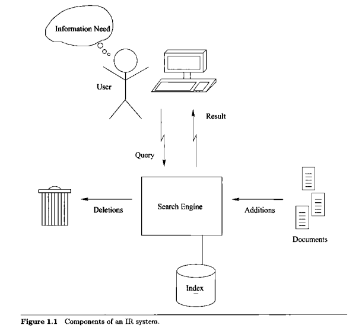
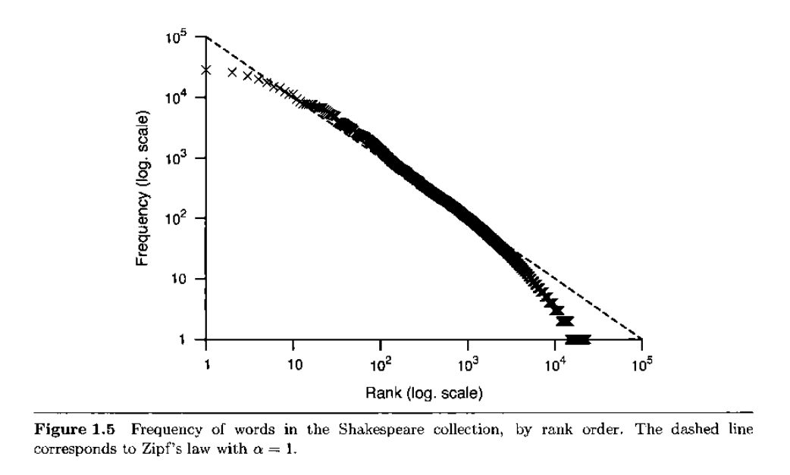
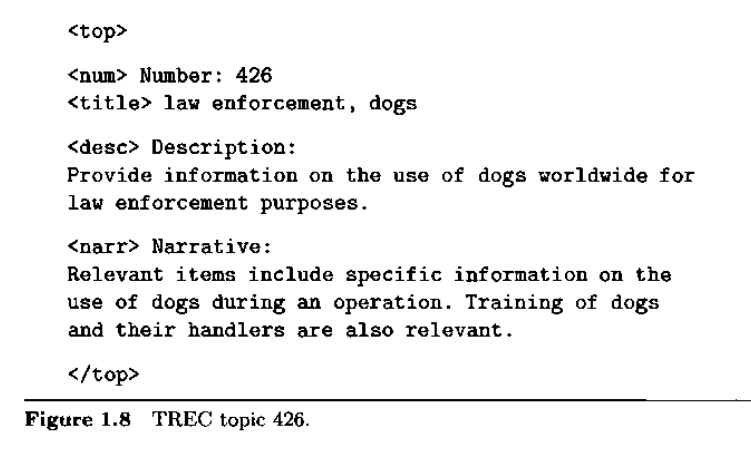

# Information Retrieval Systems

Information retrieval concerns the representation, search ad manipulation of large collections of electronic text and similar human-language data.

Examples:
- Web Search
- Enterprise Search
- Desktop Search

Other IR applications: document routing, filtering, and selective dissemination; text clustering and categorization; summarization; information extraction; information extraction; topic detection and tracking; expert search; question answering etc.

### Basic IR System Architecture

### Performance evaluation

Efficiency: measured in terms of time and (storage) space.

- Response time (or latency): interval between issuing a query and getting the search results.

Effectiveness: unlike efficiency, depends on human judgement.

- Relevance: whether a document satisfies the information need represented in the query. Might be binary (relevant or not relevant) or graded (perfect, excellent, good, fair etc).

Specificity: how much a document's content are focused on the information need.

- "A highly specific document consists primarily of material related to the information need."

Exhaustivity: how much a document covers the information related to the need.

- "A marginally exhaustive document may cover only limited aspects [of the need]".

More [here](https://en.wikipedia.org/wiki/Evaluation_measures_(information_retrieval)).

### Working with electronic text

Token: roughly corresponds to a sequence ofalphanumeric characters.

Vocabulary ($\nu$): set of distinct tokens in a collection.

### Term distribution

**Zipf's law**:

$$
\log(\textrm{frequency}) = C - \alpha \cdot \log(\textrm{rank})
$$

or 

$$
\mathcal{F}_i \sim \frac{1}{i^\alpha}
$$

where $\mathcal{F}_i$ is the frequency of the $i$-th most frequent term.

More [here](https://en.wikipedia.org/wiki/Zipf%27s_law).

### Language Model

A "special kind of probability distribution".

**Simplest language model**: fixed probability distribution over symbols in vocabulary. 

$$
\sum\_{\sigma \in \nu} \mathcal{M}(\sigma) = 1
$$

It is based on an existing text, so that:

$$
\mathcal{M}(\sigma) = \frac{\textrm{frequency}(\sigma)}{\sum\_{\sigma' \in \nu} \textrm{frequency}(\sigma')}
$$

"For this simple language model, we consider each term in isolation."

**Higher-order language models**: allow context to be taken into account.

First-order language model (conditional probabilities which depend on the previous symbol):

$$
\mathcal{M}_1 (\sigma_2 | \sigma_1) = \frac{\textrm{frequency}(\sigma_1 \sigma_2)}{\sum\_{\sigma' \in \nu} \textrm{frequency}(\sigma_1 \sigma')}
$$

It is equivalent to the zero-order model of bigrams.

$n$-th order model (zero-order model of $(n+1)$-grams):

$$
\mathcal{M}_n (\sigma\_{n+1} | \sigma_1 \dots \sigma_n) = \frac{\mathcal{M}_0(\sigma_1 \dots \sigma\_{n+1})}{\sum\_{\sigma' \in \nu} \mathcal{M}_0(\sigma_1 \dots \sigma_n \sigma')}
$$

**Smoothing**

Smoothed model:

$$
\mathcal{M}'_1 (\sigma_2 | \sigma_1) = \gamma \cdot \mathcal{M}_1 (\sigma_2 | \sigma_1) + (1-\gamma) \cdot \mathcal{M}_0 (\sigma_2)
$$

- "First-order models can be smoothed using zero-order models; second-order models can be smoothed sing first-order models; and so forth."

- "[T]he zero-order model $\mathcal{M}\_{S,0}$" for a small collection $S$ can be smoothed using another zero-order model, built from a larger collection $L$: $\mathcal{M}'\_{S,0} = \gamma \cdot \mathcal{M}\_{S,0} + (1-\gamma) \cdot \mathcal{M}\_{L,0}$".

### Test collections

**TREC** (Text REtrieval Conference)

- "[A] series of experimental evaluation efforts conducted annually by the U.S. Nationa Instituteof Standards and Technology (NIST)".

- Benefits:
    - Focus on common problems with common data.
    - Creation of reusable test collections.

- Adhoc tasks: basic searches (return a ranked list off a static set of documents). Also include sets of topics and sets of relevance judgements (qrels).

- Structural convention:
    - Every TREC document are bookended by `<DOC>...</DOC>`.
    - The document unique identifier is wrap in `<DOCNO>...</DOCNO>`. The sme identifier is used in qrels.

- Typical TREC adhoc topic:
    - title: keyword query
    - description: "longer statement of the topic requirements, in the form of a complete sentence or question". Can be used as query by NLP serch engines.
    - narrative: may be a full paragraph; provides additional information to specify a relevant document; mainly used by human assessors.

    

### Open-source IR systems

Lucene:
- [Lucene tutorial](https://datawarrior.medium.com/building-a-search-engine-lucene-tutorial-a515e3bfb44b)
- [Configuring Lucene](https://www.ibm.com/docs/en/control-desk/7.6.1.x?topic=configuring-lucene-search-engine)
- [Lucene4IR](https://strathprints.strath.ac.uk/60832/1/Azzopardi_etal_ACMSF_2016_Developing_information_retrieval_evaluation_resources_using_Lucene.pdf)

Indri:
- [Lemur project](https://www.lemurproject.org/indri/)
- [Extended paper](https://ciir.cs.umass.edu/pubfiles/ir-407.pdf)

Wumpus:
- [Homepage](http://stefan.buettcher.org/cs/wumpus/index.html)
- [HandWiki](https://handwiki.org/wiki/Software:The_Wumpus_Search_Engine)

### Further reading

Journal series:
- [ACM Transactions on Information Systems](https://dl.acm.org/journal/tois)
- [Foundations and Trends in Information Retrieval](https://dl.acm.org/journal/trir)
- [Information retrieval](https://dl.acm.org/journal/infre)
- [Information Processing and Management](https://www.sciencedirect.com/journal/information-processing-and-management)

Research conferences:
- [SIGIR](https://sigir-2024.github.io/): [2024 proceedings](https://dl.acm.org/doi/proceedings/10.1145/3626772)
- [CIKM](https://cikm2024.org/)
- [JCDL](https://dl.acm.org/conference/jcdl)
- [ECIR](https://www.ecir2024.org/)
- [WSDM](https://dl.acm.org/conference/wsdm)
- [SPIRE](http://computo.fismat.umich.mx/spire2024/)
